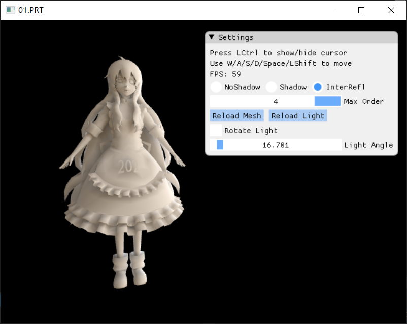
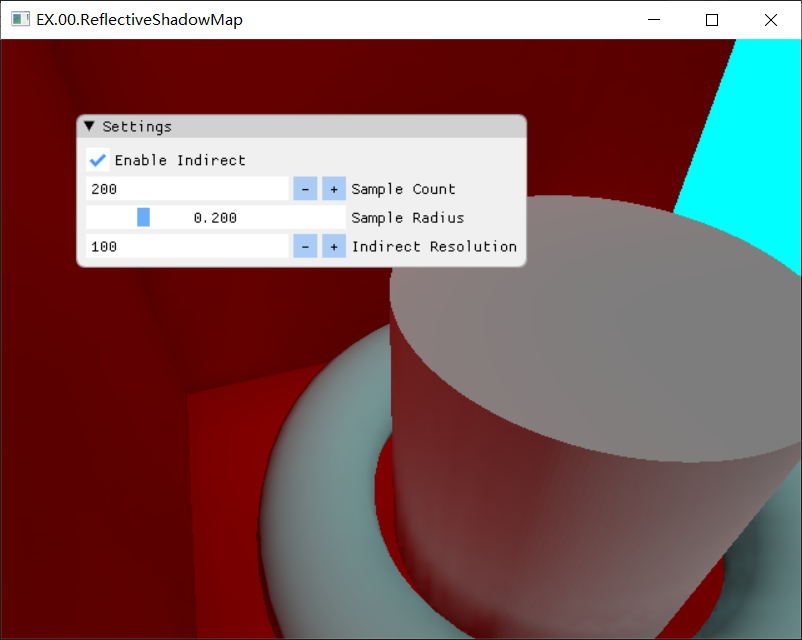

## GAMES 202

GAMES202课程内容实现。未使用官方提供的基于WebGL的框架，而是用C++和DirectX 11硬写的。除作业外，也会实现一些其他课程内容相关的、工作量较小的算法。

使用：

```powershell
git clone --recursive https://github.com/AirGuanZ/GAMES202.git
cd GAMES202
mkdir build
cd build
cmake ..
```

进度：

- [x] 作业1：PCSS阴影
  * PCF
  * PCSS
  * VSM
  * ESM
- [x] 作业2：基于球谐函数的预计算辐射传输
  
  * 球谐系数计算和旋转
  * 无阴影
  * 有阴影
  * 有间接光照
- [x] 拓展1：Reflective Shadow Maps
  * 基于poisson disk样本采样RSM，计算低分辨率间接光照，然后上采样到屏幕
  * 对G-Buffer上法线/颜色变化剧烈的部分，不使用低分辨率计算结果，转而进行精确计算






